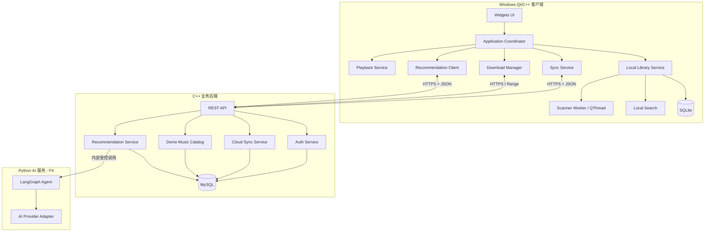

# QQMusic 扩展项目规格书

> 文档性质：持续维护的产品与技术主计划  
> 项目定位：面向 C++/Qt 客户端、上位机开发与 C++ 后端实习岗位的作品项目  
> 当前基线：Qt 5.14.2、C++11、qmake、Qt Widgets、QMediaPlayer、SQLite  
> 文档状态：需求访谈已完成，待按阶段实施  
> 最后更新：2026-08-11

---

## 1. 文档使用方式

本文件是项目扩展、验收和复盘的唯一主计划。开发时一次只领取一个边界清晰的模块，不允许为了完成当前模块顺手重构无关代码。

- `[ ]`：尚未开始。
- `[~]`：正在开发，但尚未通过全部验收。
- `[x]`：实现、测试、回顾和文档均已完成。
- `[!]`：被外部条件或技术决策阻塞，必须注明原因。
- `[-]`：明确取消，必须记录取消理由和替代方案。

只有满足本文件“完成定义（Definition of Done）”的任务才能勾选为 `[x]`。每个模块完成后，必须填写“模块回顾”，并在 Git 中留下可回退的提交点。

---

## 2. 产品愿景与成功标准

### 2.1 产品愿景

在保留现有本地播放器能力的基础上，将项目逐步升级为一个具备离线优先体验、后台任务、网络服务、云同步、个性化推荐与 AI 助手能力的桌面音乐客户端。

项目不以复刻商业 QQ 音乐为目标，而以展示以下工程能力为目标：

1. Qt/C++ 桌面客户端设计与稳定性治理。
2. 多线程、异步网络、数据持久化和异常恢复。
3. C++ REST 后端、MySQL、容器部署与跨设备同步。
4. 可解释推荐系统与受控 AI Agent 集成。
5. 可测试、可打包、可复盘、可持续演进的工程流程。

### 2.2 目标岗位优先级

1. C++/Qt 客户端开发。
2. 上位机开发。
3. C++ 后端开发。
4. 通用软件开发。
5. AI 应用开发。

### 2.3 项目级成功标准

- [ ] Windows 10 及以上系统可通过便携包直接启动客户端。
- [ ] 新用户无需登录即可完成本地导入、搜索、播放、歌词和换肤。
- [ ] 万级本地歌曲扫描期间 UI 保持响应，并显示进度、取消和结果摘要。
- [ ] 网络、数据库、损坏文件和无歌词等异常不会导致崩溃或旧状态污染。
- [ ] 后端可通过 Docker Compose 在 Ubuntu 24.04 或新的 Linux 主机上迁移启动。
- [ ] 登录用户可同步收藏、最近播放、歌单、主题设置和基础推荐画像。
- [ ] 在线演示曲库可完成搜索、播放、下载与离线缓存闭环。
- [ ] 推荐结果有数据依据、可解释，并支持“不感兴趣”反馈。
- [ ] AI 服务不可用时，本地播放和基础推荐仍可使用。
- [ ] 每个主要模块均有验收记录、测试结果和面试可讲述的技术回顾。

### 2.4 非目标

- 不以破解、抓取或绕过商业音乐平台版权限制为目标。
- 第一版不做手机号/邮箱验证码、找回密码和第三方登录。
- 第一版不做社交、评论、直播、会员和支付。
- 第一版不做跨设备播放进度续播。
- 第一版 AI 不直接控制播放、暂停、切歌或下载。
- 不为了展示技术名词而提前引入 Redis、微服务拆分或复杂多 Agent。
- 主要模块完成前不迁移 Qt 6；迁移作为独立可选阶段评估。

---

## 3. 当前项目基线

### 3.1 已有能力

- Qt Widgets 主界面、无边框窗口和托盘。
- `QMediaPlayer` / `QMediaPlaylist` 本地播放链路。
- 本地歌曲导入、收藏、最近播放和 SQLite 持久化。
- LRC 歌词解析与播放位置同步。
- 播放模式、音量、进度条和基础推荐展示。
- `QSharedMemory` 单实例控制。

### 3.2 当前架构约束

- 当前客户端保持 Qt 5.14.2、C++11 和 qmake，先保证稳定演进。
- 原有功能和用户可见行为默认保持兼容。
- 允许修复缺陷、拆分职责和增加必要接入代码。
- 优先通过新增类和清晰接口扩展，避免持续膨胀 `QQMusic` 主窗口类。
- Qt 6/CMake 迁移不得与业务功能混在同一模块中。

---

## 4. 目标架构



### 4.1 组件边界

| 组件 | 职责 | 禁止承担的职责 |
|---|---|---|
| Qt UI | 展示状态、接收操作、无阻塞反馈 | 直接执行扫描、网络重试和批量数据库操作 |
| Application Coordinator | 组织跨模块信号和生命周期 | 保存多份业务数据或实现全部业务算法 |
| Playback Service | 队列、播放状态、seek、当前媒体 | 账号、同步和推荐排序 |
| Local Library Service | 歌曲索引、去重、文件状态、查询 | 更新 UI 控件 |
| Scanner Worker | 文件遍历、元数据读取、取消与进度 | 跨线程操作 UI 或复用主线程数据库连接 |
| Sync Service | 本地变更队列、上传、拉取、冲突处理 | 决定 UI 展示细节 |
| C++ Backend | 鉴权、云数据、曲库、推荐候选与排序 | 保存客户端 API Key 或直接控制客户端 UI |
| Python AI Service | 意图理解、歌单策划、推荐理由、Agent 状态 | 作为唯一推荐来源或直接访问客户端文件系统 |

### 4.2 技术选型与理由

| 范围 | 选型 | 理由 |
|---|---|---|
| 桌面端 | Qt 5.14.2 + C++11 + qmake | 与现有代码兼容，先控制迁移风险 |
| 本地存储 | SQLite | 单机、离线、零部署，适合音乐库和同步队列 |
| C++ 后端 | 优先评估 Drogon，C++17 | 异步 HTTP、Linux/Docker 友好、可连接 MySQL；正式锁定前完成技术验证 |
| 服务端存储 | MySQL 独立数据库与低权限账号 | 腾讯云已有环境，适合账号及同步数据 |
| AI 服务 | Python + FastAPI + LangGraph（P4） | AI 生态成熟，与 C++ 核心业务边界清晰 |
| AI 模型 | P4 再选；统一 OpenAI-compatible Provider 接口 | 避免绑定厂商，DeepSeek 等作为候选 |
| 部署 | Docker Compose + 环境变量 + 数据库迁移 | 方便腾讯云、其他云服务器和虚拟机之间迁移 |
| Redis | 暂缓 | 当前规模没有必要；出现缓存、限流或任务队列需求后再评估 |

### 4.3 数据职责

**SQLite 保存：**

- 本地歌曲索引与文件可用状态。
- 收藏、最近播放、用户歌单的本地副本。
- 主题和客户端设置。
- 待同步操作、最后同步版本和失败原因。
- 下载任务、缓存索引和本地推荐特征。

**MySQL 保存：**

- 用户账号和安全凭据摘要。
- 云端收藏、历史、歌单、主题设置和推荐画像。
- 演示曲库元数据与下载授权信息。
- 同步版本、幂等键、审计所需的最小日志。

---

## 5. 核心用户流程

### 5.1 游客流程

1. 启动客户端，无需登录进入本地音乐页。
2. 导入文件或目录，后台扫描并显示进度。
3. 搜索、播放、收藏、查看歌词和切换主题。
4. 收藏等操作先保存本地。
5. 进入云同步、在线音乐或 AI 时提示登录，不强制退出当前流程。

### 5.2 登录与同步流程

1. 用户使用用户名和密码登录，客户端不持久化明文密码。
2. 登录成功后拉取云端数据并与本地数据合并。
3. 日常修改先落本地，再异步进入同步队列。
4. 界面显示“待同步、同步中、已同步、失败”状态。
5. 收藏和历史自动合并；无法自动合并的歌单冲突由用户选择版本。
6. token 失效时暂停同步并提示重新登录，不影响本地播放。

### 5.3 在线搜索与下载流程

1. 用户搜索演示曲库，结果分页返回。
2. 用户可在线播放合法测试歌曲。
3. 下载任务显示进度、速度、暂停/取消、失败和重试状态。
4. 下载完成后校验文件并加入本地音乐库。
5. 网络中断后保留任务状态，恢复后可继续或重新下载。

### 5.4 推荐与 AI 流程

1. 基础推荐读取收藏、播放完成、跳过、不感兴趣和时间衰减等特征。
2. 冷启动用户先选择偏好歌手/风格，并使用演示曲库热门内容兜底。
3. 推荐页展示推荐理由并允许反馈。
4. 用户主动进入 AI 助手，输入自然语言歌单需求。
5. Agent 查询脱敏偏好和候选歌曲，生成结构化歌单与理由。
6. AI 失败时回退到基础推荐，不影响播放器核心功能。

---

## 6. 分阶段 TODO

### P0：现有缺陷修复与工程基线

目标：在扩展功能前建立稳定、可测试、可回退的客户端基线。

- [x] `P0-01` 防御播放列表 `currentIndexChanged(-1)`，消除负索引访问崩溃。
- [x] `P0-02` 歌词解析前清空旧数据，无歌词或打开失败时显示明确空状态。
- [x] `P0-03` 修复 LRC 小数秒/毫秒解析，覆盖 1、2、3 位小数和异常时间标签。
- [x] `P0-04` 移除元数据解析的无限事件循环等待，改为可超时、可失败的异步流程。
- [x] `P0-05` 初始化 `totalTime`、`isDrag`、`musicDuration` 等状态，消除未定义行为。
- [x] `P0-06` 让 SQLite 初始化显式返回结果；打开失败时停止依赖数据库的后续初始化。
- [x] `P0-07` 使用稳定的应用数据目录保存数据库，不依赖进程当前工作目录。
- [x] `P0-08` 统一退出与持久化路径，覆盖托盘退出、窗口关闭和 Alt+F4。
- [x] `P0-09` 检查 `QSharedMemory::create()` 结果并记录单实例初始化错误。
- [x] `P0-10` 修正托盘等 Qt 资源路径不一致问题。
- [x] `P0-11` 修复重复导入后播放列表重复追加的问题。
- [x] `P0-12` 数据库批量保存使用事务，失败时回滚并报告。
- [x] `P0-13` 将同步 `repaint()` 等潜在阻塞刷新改为合适的事件循环更新方式。
- [x] `P0-14` 修复推荐分页丢弃尾项等边界问题。
- [x] `P0-15` 为进度比例、零时长、空列表、失效 URL 等输入增加边界保护。
- [x] `P0-16` 建立最小测试工程、构建说明、日志规范和模块回顾目录。

**P0 验收标准：**

- 清空或切换播放列表不会崩溃。
- 无歌词歌曲不会显示上一首歌词。
- 损坏或不支持的音频不会造成无限等待。
- SQLite 打开失败时用户得到明确提示，程序不会继续执行依赖操作。
- 正常关闭路径均可保持收藏和历史状态。
- Debug/Release 构建通过，关键修复有回归测试或明确的手工复现记录。

### P1：本地体验与多线程能力

#### P1A 本地搜索

- [x] `P1A-01` 支持按歌曲名、歌手、专辑进行不区分大小写的模糊搜索。
- [x] `P1A-02` 支持清空、无结果、输入法组合和快速连续输入。
- [ ] `P1A-03` 万级数据搜索目标 P95 小于 150 ms，不阻塞播放。
  - 自动基线已覆盖 10,000 条本地数据的单次搜索耗时；真实设备上的 P95 压力验收暂缓到具备可重复压力数据时执行。
- [x] `P1A-04` 搜索结果可直接播放、收藏和定位本地文件状态。

#### P1B 主题换肤

- [x] `P1B-01` 新增主题管理器，集中管理 QSS、图标和资源。
- [x] `P1B-02` 游客可换肤，选择写入本地设置。
- [ ] `P1B-03` 登录后主题设置可同步，但同步失败不影响本地主题。
- [x] `P1B-04` 至少覆盖默认主题和一个完整备选主题，无局部样式残留。

#### P1C 桌面歌词

> 状态：暂缓。当前保留原有内嵌歌词展示与 P0 同步能力；独立无边框歌词窗口待后续体验方案明确后单独排期，不纳入本轮 P1 手工验收。

- [ ] `P1C-01` 将歌词展示扩展为独立无边框窗口。
- [ ] `P1C-02` 支持置顶、拖动、锁定、显示/隐藏和透明度设置。
- [ ] `P1C-03` 最小化主窗口或托盘运行时歌词继续同步。
- [ ] `P1C-04` 多屏、分辨率变化和重启后恢复到可见区域。

#### P1D 后台音乐扫描

- [x] `P1D-01` 支持导入文件和目录，扫描 MP3、FLAC、WAV、AAC/M4A。
- [x] `P1D-02` 文件遍历和元数据解析进入 Worker，不阻塞 UI。
- [x] `P1D-03` 支持进度、取消、超时、失败汇总和重复文件提示。
- [x] `P1D-04` 按路径与内容特征去重；文件移动后尝试重新关联。
- [x] `P1D-05` 文件删除后标记不可用，不立即删除收藏和历史。
- [x] `P1D-06` 子线程不操作 UI，数据库连接不跨线程共享。
- [ ] `P1D-07` 万级文件扫描期间窗口可移动、可播放、可取消任务。
  - 当前已覆盖取消与 Worker 线程边界；真实万级目录下的窗口响应验收需要专项压力数据，暂缓执行。

### P2：C++ 后端、账号、网络音乐与云同步

#### P2A C++ 后端技术验证

- [~] `P2A-01` Drogon 最小验证工程已实现；待有 Docker Engine 的主机完成 HTTP、JSON、MySQL、测试和 Docker 构建实测。
- [x] `P2A-02` 已记录 ADR；当前锁定 Drogon，不并行维护 oatpp/Crow。
- [~] `P2A-03` 已实现版本化 REST API、统一错误格式、请求 ID 和日志脱敏；待容器运行验证。
- [~] `P2A-04` 已提供 Ubuntu 24.04 Docker Compose 重建配置；待 Docker 主机演练。

#### P2B 账号系统

- [ ] `P2B-01` 用户名/密码注册、登录、退出和演示账号。
- [ ] `P2B-02` 服务端使用成熟密码哈希方案及独立盐，不保存或记录明文密码。
- [ ] `P2B-03` 支持短期访问 token、续期、失效和撤销。
- [ ] `P2B-04` 客户端凭据安全存储；日志、崩溃信息中不得出现 token 和密码。
- [ ] `P2B-05` 游客本地功能不受登录服务故障影响。
- [ ] `P2B-06` 公网真实登录启用前必须具备 HTTPS；无证书阶段只用于受控开发环境。

#### P2C 演示在线曲库与下载

- [ ] `P2C-01` 使用自有测试歌曲或合法公开素材建立演示曲库。
- [ ] `P2C-02` 支持分页搜索、歌曲详情、封面和在线播放。
- [ ] `P2C-03` 建立可替换 Provider 接口，第三方平台适配不污染核心业务。
- [ ] `P2C-04` 下载支持进度、取消、重试、临时文件和完成校验。
- [ ] `P2C-05` 网络中断或磁盘空间不足时不产生伪完成文件。
- [ ] `P2C-06` 下载完成后安全加入本地库，重复内容不重复入库。

#### P2D 离线优先云同步

- [ ] `P2D-01` 同步收藏、最近播放、用户歌单、主题设置和基础推荐画像。
- [ ] `P2D-02` 本地修改先落 SQLite，再进入可恢复的同步队列。
- [ ] `P2D-03` 收藏和历史按幂等规则自动合并。
- [ ] `P2D-04` 无法自动合并的歌单冲突提供本地版/云端版选择。
- [ ] `P2D-05` 展示待同步、同步中、已同步和失败状态，普通成功不弹窗打断。
- [ ] `P2D-06` 断网、服务重启和 token 过期后不丢待同步操作。
- [ ] `P2D-07` 第一版不实现跨设备播放进度续播。

### P3：可解释推荐系统

- [ ] `P3-01` 定义最小行为事件：播放开始、完成率、快速跳过、收藏、取消收藏、不感兴趣和搜索。
- [ ] `P3-02` 明确事件去重、时间戳、版本和隐私字段。
- [ ] `P3-03` 实现不依赖大模型的基础偏好评分与时间衰减。
- [ ] `P3-04` 结合歌手、风格、年代、语言和情绪标签生成候选集。
- [ ] `P3-05` 冷启动支持选择偏好歌手/风格，并提供演示曲库热门兜底。
- [ ] `P3-06` 推荐过滤不可播放、重复和明确“不感兴趣”的歌曲。
- [ ] `P3-07` 每条推荐提供可追溯理由，不暴露内部敏感数据。
- [ ] `P3-08` 建立离线评估样例和人工验收集，记录推荐变化原因。
- [ ] `P3-09` AI 不可用时推荐页仍完整工作。

### P4：AI 个性化歌单 Agent

- [ ] `P4-01` 实施前比较 DeepSeek、OpenAI 或其他兼容 Provider 的价格与能力。
- [ ] `P4-02` Provider 通过配置切换，不在业务代码中写死模型名、地址或 Key。
- [ ] `P4-03` 验证 Tool Calling、结构化输出、流式响应、上下文、限流和失败行为。
- [ ] `P4-04` Python FastAPI AI 服务与 C++ 业务后端通过受控内部 API 通信。
- [ ] `P4-05` LangGraph 状态包含意图、偏好摘要、候选歌曲、过滤条件、结果和失败状态。
- [ ] `P4-06` Agent 工具只允许查询脱敏画像、搜索候选和创建建议歌单。
- [ ] `P4-07` 支持“分析最近听歌”“按场景生成歌单”和“解释推荐理由”。
- [ ] `P4-08` 用户确认后才保存 AI 生成歌单；第一版不直接控制播放器和下载。
- [ ] `P4-09` AI 超时、限流、输出不合法时可重试或回退，不影响核心服务。
- [ ] `P4-10` 没有 API Key 时明确禁用 AI 入口或展示可恢复配置状态。
- [ ] `P4-11` 设置调用频率、上下文长度和预算上限，避免无边界成本。
- [ ] `P4-12` 不上传本地路径、密码、token 和未经允许的完整播放历史。

### P5：后期可选增强

- [ ] `P5-01` Redis：仅在推荐缓存、接口限流或后台任务队列出现明确需求时引入。
- [ ] `P5-02` 邮箱/短信验证、找回密码和第三方登录。
- [ ] `P5-03` Qt 6/CMake 迁移技术验证与独立迁移计划。
- [ ] `P5-04` 第三方音乐平台合法适配器。
- [ ] `P5-05` 安装包、自动更新、代码签名与崩溃报告。
- [ ] `P5-06` 跨设备播放进度续播。
- [ ] `P5-07` 用 C++ 实现精简 Agent 状态机，作为与 LangGraph 的工程对比。

---

## 7. API 边界

### 7.1 API 原则

- `/api/v1` 起步，客户端不得依赖未版本化接口。
- 请求和响应使用 JSON；下载流与封面使用独立媒体响应。
- 错误包含稳定错误码、用户可读消息和请求 ID，不返回堆栈或 SQL。
- 创建/同步操作携带幂等键，客户端重试不得产生重复数据。
- 分页接口必须有稳定排序和游标/页码边界。
- 超时、取消和重试由客户端服务层统一处理，UI 不直接拼接 URL。

### 7.2 预期资源边界

- `/auth/*`：注册、登录、续期、退出。
- `/users/me`：当前用户基础信息。
- `/sync/*`：拉取增量、提交变更、冲突确认。
- `/songs/*`：演示曲库搜索、详情、播放和下载授权。
- `/recommendations/*`：基础推荐、反馈和画像摘要。
- `/ai/*`：创建 AI 推荐任务、查询结果；P4 前不存在也不影响客户端。

具体字段、状态码和数据库表结构在对应模块开发前形成子规格或 ADR，本文件只约束边界与行为。

---

## 8. UI/UX 规格

### 8.1 设计原则

- 保留当前播放器的主体结构和播放逻辑，逐模块提高一致性，不一次性重做全部界面。
- 游客模式为默认可用状态；只有进入在线、同步和 AI 能力时提示登录。
- 换肤是本地基础能力，不要求登录；登录后可同步主题选择。
- 长任务必须显示进度、取消和结果，不能用无响应窗口表示“处理中”。
- 普通同步成功使用轻量状态提示；冲突、重新登录和不可恢复错误才使用对话框。
- 图标、字体、间距、加载、空状态、失败状态和禁用状态应统一。

### 8.2 计划新增界面

- 本地搜索与筛选区。
- 扫描进度/结果界面。
- 主题选择入口。
- 桌面歌词设置。
- 登录/注册界面和账号菜单。
- 在线搜索与歌曲详情。
- 下载管理页。
- 云同步状态与冲突处理。
- 推荐页和推荐反馈。
- AI 歌单助手页。

### 8.3 响应与可用性

- 窗口缩放、常见 DPI 和多显示器下不应出现关键控件重叠或不可点击。
- 文本不得被按钮或容器裁切；长歌名使用省略和完整提示。
- 加载、空数据、断网、未登录、无权限和服务故障必须有不同状态。
- 键盘焦点、Enter/Escape 和列表双击行为保持一致。
- 改造前后保留截图，作为模块验收证据。

---

## 9. 非功能需求

### 9.1 性能

- 客户端首个可交互界面目标小于 2 秒；具体以记录的参考机器为准。
- 万级本地歌曲搜索 P95 目标小于 150 ms。
- 后台扫描不得连续阻塞 UI 事件循环超过 100 ms。
- 普通 REST API 在不计算外部 AI 时间时，服务端 P95 目标小于 500 ms。
- 列表更新采用增量或批量刷新，避免逐项同步重绘造成明显卡顿。
- 下载和扫描并发有上限，不允许无限创建线程或请求。

### 9.2 稳定性与恢复

- 文件、网络、数据库和 AI 错误均不得导致客户端崩溃。
- 所有长任务可取消；取消后资源、临时文件和 UI 状态一致。
- 可重试操作采用有限次数和退避策略，不进行无限重试。
- 客户端或服务异常退出后，下载与同步任务可恢复或明确失败。
- 数据迁移前备份或使用可回滚迁移，禁止静默破坏已有 SQLite 数据。

### 9.3 安全与隐私

- 密码只通过 HTTPS 传输，服务端仅保存安全哈希。
- API Key 只存在于后端环境变量/密钥配置，不进入 Qt 客户端和 Git。
- token、密码、完整 Authorization Header 不写日志。
- 数据库使用项目独立库和低权限账号。
- AI 默认接收脱敏偏好摘要；用户可不启用 AI。
- 下载文件校验目标目录、文件名和响应类型，防止路径穿越及伪文件。

### 9.4 可扩展性与成本

- 本地、云端、推荐和 AI 通过接口隔离，可单独替换或停用。
- 腾讯云 2 核 2G 服务器只运行轻量业务服务，不部署本地大模型。
- 初期不依赖 Redis；引入前必须记录数据量、瓶颈和收益。
- AI 调用由用户主动触发，优先缓存画像摘要并限制调用频率。
- Docker 镜像、迁移脚本和持久化目录不得绑定单一云厂商。

---

## 10. 边缘案例与异常处理清单

### 本地文件

- [ ] 空目录、无权限目录、循环链接和超长路径。
- [ ] 同名不同内容、不同名相同内容和重复选择文件。
- [ ] 扫描期间文件被移动、删除或占用。
- [ ] 损坏文件、零时长文件、元数据缺失和不支持格式。
- [ ] 无歌词、乱码歌词、多时间标签和异常时间戳。
- [ ] 下载目标磁盘空间不足或目标文件已存在。

### 播放与 UI

- [ ] 空播放列表、索引 `-1`、删除当前歌曲和切换来源页。
- [ ] 播放期间扫描、搜索、同步和下载同时运行。
- [ ] 主窗口最小化/隐藏后桌面歌词与托盘状态一致。
- [ ] 多显示器拔插后悬浮歌词仍可找回。
- [ ] 数据库损坏或升级失败时提供恢复路径。

### 网络与账号

- [ ] DNS 失败、连接超时、响应超时、断网和服务端 5xx。
- [ ] token 过期、账号被撤销、重复登录和客户端时钟不准。
- [ ] 重复请求、乱序响应、分页末尾和空结果。
- [ ] 同一歌单在多设备修改导致冲突。
- [ ] 上传已删除歌曲的历史或收藏时仍保持可解释状态。

### 推荐与 AI

- [ ] 新用户无行为数据和行为数据过少。
- [ ] 用户连续跳过、取消收藏或选择“不感兴趣”。
- [ ] 候选歌曲不可播放、重复或已下载。
- [ ] AI 返回不存在的歌曲、非法 JSON、超时或拒绝回答。
- [ ] Provider 更换后 Tool Calling 或流式格式不兼容。
- [ ] AI 预算耗尽时回退到基础推荐。

---

## 11. 测试与验收策略

### 11.1 测试分层

| 测试层级 | 重点 |
|---|---|
| 单元测试 | LRC 解析、搜索、去重、推荐打分、同步合并、路径处理 |
| 组件测试 | 扫描 Worker、SQLite Repository、下载状态机、Provider 适配器 |
| API 测试 | 鉴权、分页、幂等、错误码、同步冲突和权限 |
| 集成测试 | Qt 客户端与 Docker 后端、MySQL 迁移、断网恢复 |
| UI 手工验收 | 界面状态、歌词、多屏、DPI、输入法和交互一致性 |
| 发布验证 | 干净 Windows 环境、便携包依赖、首次启动和升级旧数据库 |

### 11.2 自动化优先级

- 必须自动化：账号安全逻辑、同步合并、推荐排序、LRC 解析、下载状态转换。
- 优先自动化：搜索、去重、数据库迁移、API 错误映射。
- 以手工和截图为主：纯视觉、动画、多显示器布局。
- 后期 CI 至少执行客户端构建、后端构建、单元测试和 API 测试。

### 11.3 模块完成定义

模块只有同时满足以下条件才能标记 `[x]`：

- [ ] 功能范围与本文件一致，未夹带无关改动。
- [ ] 正常流程、边缘案例和失败流程均已验证。
- [ ] Debug/Release 或对应服务构建通过。
- [ ] 关键逻辑有自动测试；无法自动化的部分有手工验收记录。
- [ ] 未引入明文密钥、密码、版权不明的媒体文件或生成物污染。
- [ ] Git diff 已审查，主分支保持可编译、可运行。
- [ ] 用户可见变化和迁移影响已记录。
- [ ] 模块回顾已完成，`SPEC.md` 状态已更新。

---

## 12. Git 与持续开发流程

### 12.1 分支规则

- `master`：始终保持可构建和可演示。
- `feature/<module>`：独立功能，例如 `feature/local-search`。
- `fix/<issue>`：独立缺陷，例如 `fix/playlist-negative-index`。
- `chore/<scope>`：构建、文档或无业务变化的工程任务。
- 一个分支对应一个可验收模块，不为单个按钮创建分支。

### 12.2 提交规则

- 提交必须可解释、可回退，避免“完成全部功能”式超大提交。
- 建议格式：`type(scope): summary`，如 `fix(lrc): clear stale lyrics on parse failure`。
- 数据库迁移、API 契约和客户端适配尽可能拆成有顺序的提交。
- 合并前必须完成模块验收和回顾；不提交构建目录、密钥和本地数据库。

### 12.3 模块开发循环

```text
从 SPEC 选择一个模块
  -> 明确范围、依赖和验收标准
  -> 创建 feature/fix 分支
  -> 读取相关代码并形成模块实施说明
  -> 小步实现与测试
  -> 编译、异常验证和 Git diff 审查
  -> 填写模块回顾
  -> 合并主分支并更新复选框
```

---

## 13. Vibe Coding 使用规范

### 13.1 模型分级

| 场景 | 建议模型/思考强度 |
|---|---|
| 文案、QSS、简单控件、机械修改 | Luna medium 或 Terra medium |
| 搜索、换肤、桌面歌词、普通接口 | Terra high |
| 边界清晰的 Qt/C++ 模块 | Terra high |
| 多线程、生命周期、崩溃排查 | Sol high |
| 鉴权、同步、数据库迁移 | Sol high 设计，Terra high 实现，Sol high 复审 |
| 推荐算法和数据模型 | Sol high 设计，Terra high 实现 |
| LangGraph、工具调用、状态恢复 | Sol high 或 xhigh |
| 跨模块重构和长期疑难问题 | Sol xhigh |
| 测试补充、文档、模块回顾 | Terra medium/high |
| 发布前整体审查 | Sol high |

模型名称和可用性以后可变化；选择原则是简单任务使用均衡模型，涉及并发、安全、数据一致性和架构边界时升级模型，而不是所有任务固定最高强度。

### 13.2 AI 协作质量门禁

- AI 开始修改前必须先阅读目标模块、相关测试和本文件。
- 每次提示限定一个模块、明确禁止无关重构，并给出验收标准。
- 不接受只展示代码而不实际构建、运行测试或检查 diff 的“完成”。
- AI 生成的测试必须说明测试目标、输入和失败含义。
- 并发、安全、数据库迁移和删除操作必须额外复审。
- 关键架构决策写入 ADR，不能只存在聊天记录中。
- 开发模型与音乐项目运行时使用的 AI Provider 是两套独立选择，不得混淆。

---

## 14. 部署与交付

### 14.1 客户端

- [ ] 第一阶段提供 Windows 10+ 便携版压缩包。
- [ ] 使用干净环境验证 Qt、多媒体、SQL 驱动和运行库依赖。
- [ ] 应用数据写入标准用户数据目录，不写安装目录。
- [ ] 后期再制作安装包、卸载、快捷方式和自动更新。

### 14.2 后端

- [ ] Docker Compose 描述 C++ API、MySQL 连接和 P4 AI 服务。
- [ ] 配置通过 `.env.example` 说明，真实 `.env` 不提交。
- [ ] 数据库迁移可重复执行，并记录当前 schema 版本。
- [ ] 持久化卷、备份和恢复步骤写入部署文档。
- [ ] 在腾讯云 Ubuntu 24.04 验证，迁移到其他 Linux 主机不修改业务代码。
- [ ] 公网账号服务上线前补充域名、HTTPS、防火墙和最小暴露端口。

### 14.3 交付物优先级

**必须：**

- [ ] 源代码与可复现构建说明。
- [ ] `SPEC.md`、README、架构图和模块回顾。
- [ ] Windows 便携版。
- [ ] Docker Compose、数据库迁移和演示账号。
- [ ] 合法演示曲库及来源说明。

**后期增强：**

- [ ] Windows 安装包。
- [ ] 自动化 CI/CD。
- [ ] 演示 GIF/视频。
- [ ] 公网域名和完整 HTTPS 部署。
- [ ] 自动更新与代码签名。

---

## 15. 风险与权衡

| 风险 | 影响 | 应对方式 |
|---|---|---|
| 商业音乐 API 不稳定或版权受限 | 网络模块阻塞或无法公开展示 | 先完成合法演示曲库闭环，第三方接入使用适配器并延期 |
| Qt 5 多媒体格式依赖系统后端 | 不同机器播放能力不一致 | 启动时检测、打包验证、展示不支持原因 |
| 同时引入客户端、后端和 AI 范围过大 | 长期无法形成可演示版本 | 严格按 P0-P4 阶段推进，每阶段保持可运行 |
| 为展示多线程而错误拆线程 | 竞态、崩溃和数据库问题 | 只将耗时 I/O/解析放 Worker，UI 保持主线程，连接不跨线程 |
| 双服务增加部署复杂度 | 2 核 2G 资源紧张 | P4 前只部署 C++ 服务；AI 调云模型，不部署本地大模型 |
| Vibe Coding 产生不可解释代码 | 面试无法回答、隐藏缺陷 | 小任务、真实验证、diff 审查、模块回顾和关键模块二次复审 |
| 公网无 HTTPS | 账号凭据泄露 | HTTPS 完成前禁止真实公网账号使用 |
| 数据库迁移破坏本地历史 | 用户数据丢失 | schema 版本、迁移测试、备份与回滚 |
| AI 成本或 Provider 不兼容 | 功能不可用或超预算 | Provider 抽象、调用上限、结构化校验和基础推荐回退 |

---

## 16. 决策门（Decision Gates）

- [ ] `DG-01` P0 完成后，确认现有架构是否足以继续扩展，是否先拆分 `QQMusic` 职责。
- [ ] `DG-02` P1D 前，确定元数据解析方案和线程所有权模型。
- [ ] `DG-03` P2 前，通过技术验证正式锁定 C++ Web 框架。
- [ ] `DG-04` 公网登录前，确认域名、HTTPS、密码哈希和 token 存储方案。
- [ ] `DG-05` 在线下载前，确认演示媒体版权和分发范围。
- [ ] `DG-06` P3 前，冻结行为事件定义和推荐评估样例。
- [ ] `DG-07` P4 前，比较 AI Provider、成本、Tool Calling 和结构化输出能力。
- [ ] `DG-08` 主要模块完成后，再决定是否迁移 Qt 6/CMake。
- [ ] `DG-09` 观察到明确性能瓶颈后，再决定是否引入 Redis。

---

## 17. 模块回顾模板

每完成一个模块，在 `docs/reviews/` 下新增一份回顾，命名建议为 `P1D-local-library-scanner.md`。

```markdown
# 模块名称

## 基本信息

- SPEC 编号：
- Git 分支：
- 关键提交：
- 完成日期：
- 状态：已完成 / 部分完成 / 阻塞

## 本次目标

- 原始问题：
- 用户价值：
- 验收标准：

## 实际变更

- 新增文件：
- 修改文件：
- 删除文件：
- 数据库/API/配置变化：

## 架构与关键决策

- 采用的方案及理由：
- 放弃的方案及理由：
- 线程、所有权、数据流或安全边界：

## 验证记录

- 构建命令与结果：
- 自动测试与结果：
- 手工场景与结果：
- 截图或日志位置：

## 遇到的问题

- 问题现象：
- 根因：
- 修复：
- 如何防止回归：

## 遗留事项

- 已知限制：
- 后续 TODO：
- 是否影响下一阶段：

## 简历描述（有明确价值时填写）

- 一句话描述：
- 使用了什么技术：
- 解决了什么问题：
- 有什么可量化结果：

## 面试回答（有关键技术点时填写）

- 为什么采用该设计？
- 最难的问题是什么？
- 如何验证线程安全/数据一致性/异常恢复？
- 如果用户量或数据量扩大，会如何演进？
```

---

## 18. 项目总检查表

- [x] P0 现有缺陷修复与工程基线。
  - [~] P1A 本地搜索（性能基准待补）。
  - [~] P1B 主题换肤（云同步待 P2 账号系统）。
  - [~] P1C 桌面歌词（保留原有内嵌展示，独立窗口方案暂缓）。
  - [~] P1D 后台音乐扫描（万级压力验收待补）。
- [~] P2A C++ 后端技术验证（实现完成，Docker/MySQL 运行级验收待具备 Docker Engine 的主机执行）。
- [ ] P2B 账号系统。
- [ ] P2C 在线演示曲库与下载。
- [ ] P2D 离线优先云同步。
- [ ] P3 可解释推荐系统。
- [ ] P4 AI 个性化歌单 Agent。
- [ ] P5 可选增强按实际价值评估。
- [ ] Windows 便携版与干净环境验证。
- [ ] Docker 部署、数据库迁移和恢复演练。
- [ ] README、架构图、模块回顾和演示材料齐全。
- [ ] 最终简历描述只包含已经实现并能解释的能力。

---

## 19. 当前下一步

- [ ] 创建 P0 基线分支或第一个独立 `fix/*` 分支。
- [ ] 记录当前版本的可复现构建环境与运行截图。
- [x] 按风险从 `P0-01`、`P0-02`、`P0-04`、`P0-05` 开始修复。
- [x] 每个修复完成后立即测试、提交和填写简短回顾，不等待 P0 全部完成后补记。
