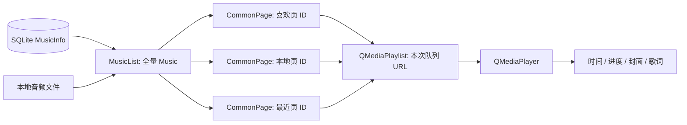

# QQMusic v1 系统流程复习

> **代码基线固定为 Git 提交 `40c19e949dead87def4bfbded406040d5ef7e7a2`（`QQMusic`，2026-08-02）。**
>
> 本文不读取、不解释当前 v2 工作区代码。它是《QQMusic 业务代码深度复习》的前置阅读版：先建立运行地图和调用关系，再回到逐行版理解具体实现。

## 怎么使用这两份文档

不要先从头硬读完逐行版。正确顺序是：

1. 先读本文第 1 节，建立组件、数据和状态的地图。
2. 按第 2 到第 10 节顺序，走一遍“用户实际会做的事情”。每一节首次遇到方法时，先看它的调用契约。
3. 读到想知道“这个方法里面每行怎么写”时，再跳到《QQMusic 业务代码深度复习》的同名模块。
4. 最后完成第 11 节的三条场景回放。能不看文档复述，才算掌握。

本文回答的是“**为什么在这里调用它、调用后状态如何变化**”；逐行版回答的是“**它内部每一行如何实现**”。两者互补，不重复。

---

## 1. 先画出整个 v1 系统

### 1.1 项目是什么

v1 是一个 Qt 5 Widgets 本地音乐播放器。核心可用功能是：

- 仅运行一个实例。
- 导入 MP3/FLAC/WAV 本地文件。
- 展示本地、我喜欢、最近播放三类歌曲。
- 全部播放、双击播放、上一首、下一首、随机/列表循环/单曲循环。
- 音量、静音、进度 seek、歌曲封面和 LRC 歌词。
- 使用 SQLite 保存歌曲信息、收藏和历史状态。

推荐页是静态图片卡片交互；电台、音乐馆、搜索、换肤均不是完整业务功能。

### 1.2 五个核心对象

| 对象 | 在系统中的身份 | 它持有的关键状态 |
| --- | --- | --- |
| `QQMusic` | 总控/协调器 | `MusicList`、SQLite、播放器、播放列表、当前播放来源页 |
| `MusicList` | 全部歌曲的数据源 | `QVector<Music>`、已导入路径集合 |
| `CommonPage` | 页面数据投影 | 当前页类型、筛选出的歌曲 ID 顺序 |
| `QMediaPlaylist` | 本次播放会话的队列 | 当前页歌曲 URL、当前索引、播放模式 |
| `QMediaPlayer` | 播放状态真相来源 | 播放状态、时长、当前位置、元数据 |

`Music` 是一首歌的值对象，包含 UUID、名称、歌手、专辑、路径、时长、喜欢和历史标记。

### 1.3 数据不会复制，而是逐层投影



关键结论：

1. `MusicList` 是**唯一的歌曲真实数据源**。
2. `CommonPage` 不保存 `Music` 副本，只保存筛选后的 `musicId`，避免三页各有一份状态。
3. `QMediaPlaylist` 也不是全量歌曲库；它只保存“这次从哪个页面发起播放”的 URL 队列。
4. `QMediaPlayer` 不是 UI 状态的附属，它才是播放/暂停、位置、媒体元数据的真实来源。

### 1.4 最重要的两条流

**命令流：用户操作如何进入系统**

```text
点击/双击/拖动
-> 自定义控件或 CommonPage 发信号
-> QQMusic 槽函数协调
-> 修改 MusicList / QMediaPlaylist / QMediaPlayer
```

**反馈流：播放器状态如何回到界面**

```text
QMediaPlayer / QMediaPlaylist 发信号
-> QQMusic 槽函数
-> 更新播放图标、时间、进度、封面、歌词、最近播放页
```

这两个方向不要混淆。按钮点击不是最终状态；播放器发出的 `stateChanged`、`positionChanged` 等信号才是最终状态反馈。

---

## 2. 流程一：启动应用，恢复上次数据

### 用户看到什么

用户双击程序：若已有实例运行，弹出提示并退出；否则显示本地下载页，历史导入的歌曲、收藏和最近播放状态被恢复。

### 调用链

```text
main
-> QApplication
-> QSharedMemory 单实例检查
-> QQMusic 构造
   -> setupUi
   -> initUI
   -> initSqlite
   -> initMusicList
   -> initPlayer
   -> connectSignalAndSlots
-> show
-> QApplication::exec
```

### 第一次遇到的方法：调用契约

| 方法 | 谁调用 | 输入 | 副作用/结果 | 何时看逐行版 |
| --- | --- | --- | --- | --- |
| `initUI()` | `QQMusic` 构造函数 | 无 | 配置窗口、托盘、页面、浮层和初始视觉 | 想理解无边框拖动、阴影、动画时 |
| `initSqlite()` | 构造函数 | 无 | 打开 `QQMusic.db`，创建 `MusicInfo` 表 | 想理解 SQL 建表时 |
| `initMusicList()` | 构造函数 | 无 | DB -> `MusicList` -> 三个页面 UI | 想理解筛选刷新时 |
| `initPlayer()` | 构造函数 | 无 | 创建播放器、播放队列、连接底层反馈 | 想理解 Qt Multimedia 信号时 |
| `connectSignalAndSlots()` | 构造函数 | 无 | 连接所有 UI 事件到业务槽 | 想梳理信号槽时 |

### 关键推导

1. `ui->setupUi(this)` 必须最先执行。没有它，`ui->localPage`、`ui->play` 等 Designer 控件尚不存在。
2. 数据库必须早于 `initMusicList()` 可用，否则不能恢复歌曲。
3. 播放器必须在连接播放相关按钮之前创建，避免槽运行时空指针。
4. `currentPage` 初始指向 `localPage`。它表示“当前播放从哪个页面来”，不是简单的“当前屏幕展示哪个页面”。
5. `QApplication::exec()` 开启事件循环后，后续用户操作和播放器信号才会真正被处理。

### 数据恢复的细节

`initMusicList()` 先调用 `MusicList::readFromDB()`：每一行 `MusicInfo` 被恢复成一个 `Music` 对象，再压入 `MusicList`。

之后三个 `CommonPage` 分别配置为：

```text
LIKE_PAGE    -> 仅展示 Music::isLike 为 true 的歌曲
LOCAL_PAGE   -> 展示 MusicList 中全部歌曲
HISTORY_PAGE -> 仅展示 Music::isHistory 为 true 的歌曲
```

它们都调用 `reFresh(musicList)`。此时没有拷贝三份歌曲，只是从同一个 `MusicList` 重新筛选出不同 ID 序列并绘制行组件。

### 这一段复习完，你应能回答

- 为什么初始化顺序是 UI -> DB -> MusicList -> Player -> 信号槽？
- 重启后“我喜欢”和“最近播放”为什么还在？
- `currentPage` 为什么不是简单的“当前可见页面”？

---

## 3. 流程二：用户切换页面，但还没有播放

### 用户操作

点击左侧“推荐 / 电台 / 音乐馆 / 我喜欢 / 本地下载 / 最近播放”。

### 调用链

```text
用户按下 btForm
-> btForm::mousePressEvent
-> 设置该按钮绿色背景
-> emit btClick(pageId)
-> QQMusic::onBtFormClicked(pageId)
-> 清除其他 btForm 背景
-> stackedWidget::setCurrentIndex(pageId)
```

### 方法契约

| 方法 | 职责 | 不做什么 |
| --- | --- | --- |
| `btForm::mousePressEvent` | 处理自身点击视觉，发出目标页 ID | 不操作 `QStackedWidget` |
| `QQMusic::onBtFormClicked` | 统一清理其他按钮样式、切换堆叠页 | 不重建播放列表、不改变歌曲数据 |
| `btForm::showAnimat/hideAnimat` | 显示/隐藏动态音符容器 | 不决定页面可见性 |

### 关键推导

1. `btForm` 知道自己的 `pageId`，但不知道主窗口的页面对象，这是合理解耦。
2. 主窗口用 `QStackedWidget` 完成切页；页面本身没有导航职责。
3. **仅浏览页面不会改变 `currentPage`。** `currentPage` 在真正播放时由 `playAllOfCommonPage` 更新，因此用户可以浏览推荐页，同时仍播放本地页的歌曲。
4. `updateBtFormAnimal()` 的语义是“哪一页正在播放”，不是“哪一页被浏览”。

### 推荐页为什么不在主数据流中

推荐页通过 `randomPicture()` 提供资源图片 JSON，由 `RecBox` 分页创建 `RecBoxItem`。卡片 hover 时只做位置动画；v1 没有将推荐卡片连接到真实歌曲、播放列表或数据库。因此它是展示模块，不是歌曲业务模块。

---

## 4. 流程三：导入本地歌曲

### 用户操作

点击底部“添加本地音乐”，在文件对话框中选择一个或多个文件。

### 调用链

```text
点击 addLocal
-> QQMusic::on_addLocal_clicked
-> QFileDialog::exec
-> selectedUrls
-> MusicList::addMusicByUrl
   -> 路径去重
   -> MIME 类型过滤
   -> Music(url)
      -> 创建 UUID
      -> parseMediaMetaData
-> localPage::reFresh(musicList)
```

### 方法契约

| 方法 | 输入 | 输出/副作用 | 为什么此时调用 |
| --- | --- | --- | --- |
| `on_addLocal_clicked()` | 用户文件选择 | 获得 `QList<QUrl>` | UI 层把选择转成业务输入 |
| `MusicList::addMusicByUrl()` | 多个本地 URL | 新歌曲加入全量集合 | 统一负责去重和格式过滤 |
| `Music(const QUrl&)` | 一个有效音频 URL | 完整的歌曲对象 | 保证加入列表后可立即展示 |
| `Music::parseMediaMetaData()` | 已保存的 `musicUrl` | 填充名称、歌手、专辑、时长 | 让 UI 有可展示的信息 |
| `CommonPage::reFresh()` | 全量 `MusicList` | 重建当前页行 UI | 将新的内存数据投影到界面 |

### 状态如何变化

```text
导入前：musicList = [旧歌曲]
选择文件：fileUrls = [URL1, URL2]
校验后：musicList = [旧歌曲, Music(URL1), Music(URL2)]
刷新后：localPage.musicListOfPage = [全量歌曲 ID]
```

### 为什么分成 `Music` 和 `MusicList`

- `Music` 负责“一首歌是什么”：路径、元数据、是否喜欢、是否播放过。
- `MusicList` 负责“所有歌如何组织”：容器、路径去重、遍历、查找、数据库读写。

如果把这些逻辑全塞进 `QQMusic`，主窗口会同时承担文件校验、解析、存储和 UI 协调，后续极难维护。

### v1 的真实限制

1. MIME 过滤支持 MP3、FLAC、WAV，但文件对话框使用 `application/octet-stream`，并非精确音频筛选。
2. `Music` 构造时同步等待媒体元数据，批量导入会阻塞 UI。
3. `addMusicToPlayList` 在导入结束后还会追加本地歌曲到已有播放列表，但正式播放入口又会重建队列；这一步在架构上多余且可能造成重复。
4. 新歌并非立即写 SQLite，而是在真正退出路径时持久化。

---

## 5. 流程四：将 `MusicList` 展示为三个不同页面

### 页面看起来不同，数据为什么一致

以“我喜欢”页为例，`CommonPage::reFresh(musicList)` 的内部业务步骤是：

```text
清空 QListWidget
-> addMusicToMusicPage(musicList)
-> 根据 pageType 得到本页歌曲 ID 列表
-> 对每个 ID 回查 MusicList
-> 创建 ListItemBox 和 QListWidgetItem
-> 将自定义行控件嵌入列表
```

### 方法契约

| 方法 | 谁调用 | 它的结果 | 后续谁依赖它 |
| --- | --- | --- | --- |
| `addMusicToMusicPage` | `reFresh` | `musicListOfPage` 按页类型写入 ID | 双击播放、历史映射 |
| `reFresh` | 初始化、导入、收藏状态改变、历史变化 | 重新绘制当前页歌曲行 | 用户看见更新后的列表 |
| `getMusicIdByindex` | `QQMusic` 播放回调 | 行/播放索引映射回 UUID | 历史、元数据、歌词 |
| `ListItemBox::setLikeMusic` | `CommonPage::reFresh` | 爱心图标与歌曲状态一致 | 用户交互 |

### 为什么必须保存 ID 的顺序

假设本地全量歌曲为：

```text
MusicList: [A, B, C, D]
喜欢页：   [A, C]
```

喜欢页第 1 行索引是 `1`，它不是全量列表里的 B，而是 C。因此页面保存：

```text
musicListOfPage = [A.id, C.id]
```

以后用户双击喜欢页第 1 行，或者播放列表切到第 1 项，系统都能使用该 ID 找回 C。**索引只能在同一份排序上下文里解释，ID 才能跨页面稳定定位对象。**

### 收藏的完整回路

```text
点击 ListItemBox 爱心
-> ListItemBox 先切换本地显示状态
-> emit setLike(bool)
-> CommonPage lambda 捕获该行对应 musicId
-> emit updateLikeMusic(bool, musicId)
-> QQMusic::updateLikeMusicAndPage
-> MusicList 中真实 Music::isLike 更新
-> 喜欢/本地/最近三个页面全部 reFresh
```

为什么不让 `ListItemBox` 直接修改 `Music`？因为它只是显示一行歌曲的控件，没有全局歌曲集合，也不应负责跨页面同步。主窗口才拥有统一数据源。

---

## 6. 流程五：点击“全部播放”或双击某一首歌

这是 v1 最核心的业务分叉：两种用户操作不同，但会收敛到同一个播放入口。

### 6.1 两条入口，一条主干

```text
点击某页面“全部播放”
-> CommonPage::playAll(pageType)
-> QQMusic::onPlayAll(pageType)
-> QQMusic::playAllOfCommonPage(page, 0)

双击某页第 index 行
-> CommonPage::playMusicByindex(page, index)
-> QQMusic::onPlayMusicByIndex(page, index)
-> QQMusic::playAllOfCommonPage(page, index)
```

两种入口最终都进入：

```cpp
void QQMusic::playAllOfCommonPage(CommonPage* page, int index);
```

这就是“收敛入口”的设计价值：不用为全部播放和双击播放写两套队列重建、播放来源记录、开始播放逻辑。

### 6.2 方法契约：`playAllOfCommonPage`

| 项目 | 内容 |
| --- | --- |
| 调用者 | `onPlayAll`、`onPlayMusicByIndex` |
| 输入 | 当前播放来源页 `page`，该页中要播放的起始索引 `index` |
| 前提 | `page` 的筛选顺序与其添加到播放列表的顺序一致 |
| 副作用 | 更新 `currentPage`、清空旧队列、建立新队列、设置索引、开始播放 |
| 输出 | 无返回值；状态变化通过播放器/播放列表信号继续传播 |

### 6.3 队列重建的真实步骤

```text
currentPage = page
-> 更新侧栏“正在播放”动画
-> playList.clear()
-> page.addMusicToPlayList(musicList, playList)
-> playList.setCurrentIndex(index)
-> player.play()
```

逐步理解“为什么”：

1. `currentPage = page`：后续播放器只会告诉你“当前索引是 2”，不会告诉你它原本来自喜欢页还是本地页。必须先保存来源页，才能把索引映射回正确歌曲 ID。
2. `updateBtFormAnimal()`：让正在播放来源页的侧栏动态条显示。用户跳去其他页面浏览时，动画仍显示播放来源，这是合理的播放器语义。
3. `playList.clear()`：旧队列可能来自另一页面；不清空就会把喜欢页歌曲和本地页歌曲混在一起。
4. `page->addMusicToPlayList(...)`：以同样的 `PageType` 条件，把当前页面应展示的歌曲 URL 按相同顺序加入临时队列。
5. `setCurrentIndex(index)`：全部播放传 0；双击传用户点中的行号。
6. `player->play()`：请求播放器开始工作，真正的 UI 更新不在此处完成，而是等待信号反馈。

### 6.4 为什么 `CommonPage::addMusicToPlayList` 不能随意改

它与 `addMusicToMusicPage` 是一对隐性契约。

```text
页面显示顺序：musicListOfPage = [A, C, D]
播放队列顺序：playList         = [A.url, C.url, D.url]
```

只有这两个顺序完全一致时：

```text
playList 当前索引 1
-> currentPage.getMusicIdByindex(1)
-> C.id
-> MusicList.findMusicById(C.id)
```

才能正确拿到当前歌曲。如果以后给页面加排序、搜索、分页或过滤，必须同时保证页面 ID 顺序与播放队列 URL 顺序同步，最好抽取一个统一的“筛选结果”方法。

### 6.5 当前 v1 的边界问题

`playList->clear()` 可能发出 `currentIndexChanged(-1)`。而 v1 的 `onPlayCurrentIndexChanged` 会继续调用：

```cpp
currentPage->getMusicIdByindex(index);
```

但 `getMusicIdByindex` 只检查 `index >= size`，没有检查负数，`-1` 会越界。正确的防线要有两层：

```cpp
// QQMusic::onPlayCurrentIndexChanged
if (index < 0) return;

// CommonPage::getMusicIdByindex
if (index < 0 || index >= musicListOfPage.size()) return {};
```

这不改变本流程的设计，只是使队列切换过程在无当前曲目状态下安全。

---

## 7. 流程六：播放器开始工作后，系统如何反馈 UI

用户点击播放只是起点。真正的反馈来自 `QMediaPlayer` 和 `QMediaPlaylist` 的信号。

### 7.1 信号地图

| 信号源 | 信号 | `QQMusic` 槽 | UI/数据结果 |
| --- | --- | --- | --- |
| `QMediaPlayer` | `stateChanged` | `onPlayStateChanged` | 播放/暂停图标 |
| `QMediaPlayer` | `durationChanged` | `onDurationChanged` | 总时长 |
| `QMediaPlayer` | `positionChanged` | `onPositionChanged` | 当前时间、进度、歌词 |
| `QMediaPlayer` | `metaDataAvailableChanged` | `onMediaAvailableChanged` | 名称、歌手、封面、歌词文件 |
| `QMediaPlaylist` | `currentIndexChanged` | `onPlayCurrentIndexChanged` | 历史标记、最近页刷新 |
| `QMediaPlaylist` | `playbackModeChanged` | `onPlaybackModeChanged` | 循环模式图标 |

### 7.2 为什么要“信号驱动 UI”

错误思路是：用户点播放按钮时，立即手动换图标、刷新时间、显示封面。

问题在于播放器状态并不只会被这个按钮改变：歌曲自然结束、调用 `next()`、操作系统媒体行为、媒体加载失败都可能改变状态。正确思路是：

```text
任何原因改变播放器状态
-> 播放器发信号
-> 同一组槽函数更新 UI
```

这样 UI 永远响应真实播放状态，而不是响应“我们以为发生了什么”。

### 7.3 播放/暂停、上一首、下一首、模式切换

```text
点击 play
-> onPlayMusic
-> 根据 player.state 调 player.play 或 player.pause
-> stateChanged
-> onPlayStateChanged
-> 更新播放按钮图标
```

上一首、下一首更简洁：

```text
点击 playUp / playDown
-> playList.previous / playList.next
-> currentIndexChanged
-> 当前歌曲变更后的后续反馈
```

模式切换的状态机是：

```text
Loop（列表循环）
-> Random（随机）
-> CurrentItemInLoop（单曲循环）
-> Loop
```

`onPlaybackModeClicked` 只设置下一种模式并更新 tooltip；真正的图标由 `playbackModeChanged -> onPlaybackModeChanged` 更新。这仍是“命令”和“状态渲染”分离。

---

## 8. 流程七：切歌后，名称、封面、历史和歌词如何联动

### 8.1 当前索引变化：进入历史记录

```text
playList 当前项变为 index
-> onPlayCurrentIndexChanged(index)
-> currentIndex = index
-> currentPage.getMusicIdByindex(index)
-> musicList.findMusicById(musicId)
-> Music::isHistory = true
-> recentPage.reFresh(musicList)
```

为什么要先通过页面 ID 找回歌曲，而不直接从播放列表取？因为 `QMediaPlaylist` 保存的是媒体 URL；项目的收藏、历史、数据库主键和页面行都建立在 `Music::musicId` 上。`currentPage + index` 是 v1 从播放会话返回业务数据的桥。

### 8.2 元数据可用：刷新歌曲基本信息

```text
播放器媒体元数据可用
-> onMediaAvailableChanged(bool)
-> currentPage + currentIndex 找回 Music
-> 更新主播放区歌曲名和歌手
-> 从 QMediaPlayer::metaData("ThumbnailImage") 读取封面
-> 有封面：写主封面和当前页头图
-> 无封面：写默认资源图
-> 同步歌词页标题
-> 由 Music URL 推导 .lrc 路径并解析
```

### 方法契约：`onMediaAvailableChanged`

| 项目 | 内容 |
| --- | --- |
| 调用者 | `QMediaPlayer::metaDataAvailableChanged` 信号 |
| 输入 | `available`，表示元数据状态变化 |
| 依赖 | `currentPage` 和 `currentIndex` 必须能指向当前业务歌曲 |
| 副作用 | 更新名称、歌手、封面、当前页背景、歌词页标题和歌词数组 |
| 注意 | v1 忽略 `available` 参数，实际应在 `false` 时提前返回 |

### 8.3 LRC 路径如何得到

`Music::getMusicLrcPath()` 使用音频本地路径，并将 `.mp3/.flac/.mpga` 替换成 `.lrc`：

```text
D:/music/歌曲 - 歌手.mp3
-> D:/music/歌曲 - 歌手.lrc
```

这隐含了一个文件命名约定：歌词和音频同目录、同名、只扩展名不同。满足约定则歌词可自动加载；不满足则没有歌词。

### 8.4 v1 无歌词时的真实缺口

`LrcPage::parseLrc` 先尝试打开文件，失败直接返回 `false`，之后才在成功路径清空 `lrcLines`。所以当前歌曲没有歌词时，上一首歌词可能继续显示。

设计目标应为：

```text
切新歌
-> 无论 LRC 是否存在，先清空旧 lrcLines
-> 成功则填充新歌词
-> 失败则保持空数组，显示“暂无歌词”
```

---

## 9. 流程八：播放时间如何驱动进度条、seek 和歌词

### 自动播放进度

```text
播放器当前位置 position（毫秒）变化
-> onPositionChanged(position)
-> 格式化 mm:ss 到 currentTime
-> ratio = position / totalTime
-> MusicSlider::setStep(ratio)
-> 若 currentIndex 有效，LrcPage::showLrcWord(position)
```

三个对象各自做一件事：

| 对象 | 收到什么 | 做什么 |
| --- | --- | --- |
| `QQMusic` | 毫秒位置 | 时间格式化、比例计算、协调 UI |
| `MusicSlider` | 0~1 比例 | 计算填充条像素宽度 |
| `LrcPage` | 毫秒位置 | 找到当前歌词行并显示前后行 |

这就是“同一个时间真相，多种 UI 投影”：进度条和歌词不互相调用，它们都由播放器位置驱动。

### 用户拖动 seek

```text
鼠标按下/移动 MusicSlider
-> 控件局部 x 坐标更新填充条
鼠标松开
-> emit setMusicSliderPosition(ratio)
-> QQMusic::onMusicSliderChanged(ratio)
-> targetMs = totalTime * ratio
-> player.setPosition(targetMs)
-> 播放器再次发 positionChanged
-> 进度和歌词被真实位置统一校正
```

为什么 `MusicSlider` 不直接拿 `QMediaPlayer*` 调 `setPosition`？因为它的职责是鼠标交互与比例计算；播放器是应用级资源，应该由 `QQMusic` 协调。这样滑条可以独立复用。

### 歌词当前行如何选出

`LrcPage` 把每行歌词保存为：

```text
LineWordLine { _wordTime: 毫秒, _wordText: 文本 }
```

每次 `showLrcWord(position)`：

```text
空数组 -> 显示“暂无歌词”
position 在第 i-1 行和第 i 行时间之间 -> 当前行是 i-1
超过最后行时间 -> 保持最后一行
```

然后显示 `index - 3` 到 `index + 3`，越界则显示空字符串。v1 的时间解析有小数毫秒错误，因此歌词可能有轻微不同步；流程思想本身正确。

---

## 10. 流程九：音量、窗口与退出

### 10.1 音量与静音

```text
点击音量按钮
-> QQMusic::on_volume_clicked
-> mapToGlobal 计算 VolumeTool 弹出位置
-> VolumeTool::show

在 VolumeTool 上点击/拖动
-> 通过鼠标 Y 坐标计算 volumeRatio（0~100）
-> emit setMusicVolume(volumeRatio)
-> QQMusic::setMusicVolume
-> player.setVolume(volume)

点击静音
-> VolumeTool 翻转 isMuted 并换图标
-> emit setSilence(isMuted)
-> QQMusic::setMusicSilence
-> player.setMuted(isMuted)
```

音量浮层并不直接操控播放器，而是发出领域意图。它知道“用户选择了 60%”，主窗口才知道“要把 60% 应用到哪个播放器”。

### 10.2 无边框窗口移动

```text
鼠标左键按下 QQMusic 空白区域
-> isDrag = true
-> dragPosition = 鼠标全局位置 - 窗口左上角
鼠标移动且左键仍按下
-> move(鼠标全局位置 - dragPosition)
```

无边框窗口没有系统标题栏移动能力，所以需要这套坐标换算。`dragPosition` 的目的，是让窗口保持“鼠标按住窗口内原位置”而不是让左上角跳到鼠标下方。

### 10.3 两种“关闭”语义

```text
视觉关闭按钮 on_quit_clicked
-> hide()
-> 程序继续运行，托盘仍存在

托盘菜单“退出” onQQMusicQuit
-> MusicList::writeToDB
-> sqlite.close
-> close()
```

这是音乐播放器常见的“关闭到托盘”行为。代价是只有托盘退出路径会写库；v1 没有统一 `closeEvent`，因此其他关闭途径可能丢失最后状态。

---

## 11. 三条必须自行回放的完整场景

读完本文后，不要立即继续读所有逐行代码。先把下面三条链路口述或画在纸上；任何一步断掉，再回到本节对应流程，然后才跳到逐行版。

### 场景 A：导入一首新歌并收藏

```text
1. 点击添加本地音乐
2. QFileDialog 返回 QUrl
3. MusicList 检查路径是否已导入
4. MusicList 检查 MIME 是否是受支持音频
5. Music 构造：UUID + 元数据 + 文件名兜底
6. Music 加入唯一全量集合
7. 本地页 reFresh，创建对应 ListItemBox
8. 点击爱心，行控件只发 bool
9. CommonPage 补齐 musicId 转发给 QQMusic
10. QQMusic 修改全量 Music 的 isLike
11. 三个页面刷新，喜欢页出现该歌曲
12. 托盘退出时写入 SQLite
```

你应该能解释：为什么第 8 步不能直接写 SQLite；为什么第 10 步后需要刷新三个页面。

### 场景 B：在“我喜欢”页双击第二首歌

```text
1. 喜欢页 musicListOfPage 例如是 [A.id, C.id, D.id]
2. 用户双击第 1 行（从 0 开始）
3. CommonPage 发出 (this, 1)
4. QQMusic 调 playAllOfCommonPage(喜欢页, 1)
5. 清空旧队列
6. 按同一筛选顺序加 [A.url, C.url, D.url]
7. currentPage = 喜欢页；当前播放索引 = 1
8. QMediaPlayer 播 C.url
9. currentIndexChanged(1) 经喜欢页 ID 找回 C.id
10. MusicList 中 C.isHistory = true，最近页刷新
11. 元数据可用后，主播放区、封面、歌词页更新为 C
```

你应该能解释：为什么不能把索引 `1` 直接当作全量 `MusicList` 的索引；为什么页面列表顺序和播放队列顺序必须一致。

### 场景 C：拖动进度条到 80%

```text
1. MusicSlider 接收鼠标局部 x 坐标
2. 松开时将 x/maxWidth 转为 ratio = 0.8
3. 发出 setMusicSliderPosition(0.8)
4. QQMusic 计算 target = totalTime * 0.8
5. QMediaPlayer::setPosition(target)
6. 播放器发 positionChanged(target 或实际校正位置)
7. 主窗口更新 currentTime
8. MusicSlider 按 position/totalTime 更新填充宽度
9. LrcPage 按 position 重新选择当前歌词行
```

你应该能解释：为什么不要让滑条直接控制歌词；为什么最终应以播放器回调的位置为准。

---

## 12. 从系统版跳转到逐行版的路线

| 你现在想深挖什么 | 先读系统版 | 再读逐行版 |
| --- | --- | --- |
| 构造顺序、全局成员 | 第 2 节 | 第 1 至第 3 节 |
| 无边框、托盘、导航、导入 | 第 3、4、10 节 | 第 4、7 节 |
| SQLite、歌曲对象、去重 | 第 2、4 节 | 第 5、9、10 节 |
| 页面筛选、列表行、收藏同步 | 第 5 节 | 第 11 节 |
| 全部播放、双击、切歌、模式 | 第 6、7 节 | 第 8 节 |
| 封面、历史、时间、seek、歌词 | 第 8、9 节 | 第 8、12 节 |
| 推荐、侧栏动态、音量控件 | 第 3、10 节 | 第 13 节 |

逐行版文件：[`QQMusic_业务代码深度复习.md`](QQMusic_业务代码深度复习.md)。

---

## 13. v1 架构沉淀

### 13.1 这个项目最值得保留的设计

1. **单一数据源**：`MusicList` 是全部歌曲唯一来源；页面不保存对象副本。
2. **页面筛选与数据实体分离**：`CommonPage` 保存 ID 序列，而不是整首歌。
3. **播放会话独立**：每次从一个页面播放，都临时重建 `QMediaPlaylist`。
4. **播放器状态驱动 UI**：进度、封面、播放图标和歌词都来自播放器信号。
5. **控件发意图，主窗口做协调**：`ListItemBox`、`MusicSlider`、`VolumeTool` 不直接持有全局业务对象。

### 13.2 v1 最应记住的技术债

| 问题 | 根因 | 正确修复方向 |
| --- | --- | --- |
| 清空队列时可能负索引越界 | 缺失 `index < 0` 防御 | 调用端和 `getMusicIdByindex` 双层校验 |
| 无歌词可能残留旧词 | 打开文件失败前未清数组 | 解析函数一开始清空旧歌词 |
| 歌词毫秒计算不准 | 小数部分索引逻辑错误 | 独立解析器 + 测试样例 |
| 导入可能卡 UI | 构造函数同步等元数据 | 用异步媒体加载或后台任务 |
| 关闭路径可能不保存 | 只在托盘退出写库 | 统一 `closeEvent` 或应用退出钩子 |
| 列表刷新成本高 | 三页使用 `QListWidget` 重建 | 未来改为 Model/View、增量更新 |

### 13.3 你可以在面试中如何总结 v1

> v1 的核心是以 `MusicList` 作为歌曲单一数据源，喜欢、本地和历史页面只是按不同条件保存歌曲 ID 的视图。播放时主窗口根据来源页面重建临时 `QMediaPlaylist`，并保存 `currentPage` 和播放索引，以便把播放器状态重新映射回业务歌曲。播放器的状态、位置和元数据变化通过 Qt 信号统一驱动播放按钮、进度、封面、歌词与最近播放记录，避免 UI 与实际播放状态脱节。

## 完成标准

完成 v1 复习，不是能背出类名，而是能回答：

1. 一首歌从文件选择到 UI 出现，经过了哪些对象？
2. 为什么喜欢页能删除/增加歌曲，却不持有自己的 `Music` 容器？
3. 双击某页面歌曲时，索引如何最终定位回正确的 `Music`？
4. 为什么进度条、歌词、当前时间能同步？
5. 用户关闭窗口和真正退出程序，为什么是两条不同的流程？

这五个问题都能顺着调用链讲清楚，再回到逐行版，你看到的每一个函数就会有明确的位置，而不是孤立的实现细节。
