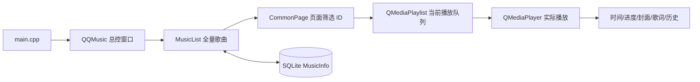

# QQMusic v1

一个基于 Qt Widgets 的本地音乐播放器 Demo。本文档对应 Git 提交 40c19e949dead87def4bfbded406040d5ef7e7a2（QQMusic，2026-08-02），即项目扩展前的 v1 代码。

> 本目录是 QQMusic v1 的独立源码快照。

## 功能概览

- Qt 无边框主窗口、窗口拖动、最小化、系统托盘和单实例运行。
- 导入本地 MP3、FLAC、WAV 文件，并解析歌曲名称、歌手、专辑和时长。
- 本地下载、我喜欢、最近播放三个歌曲页面。
- 全部播放、双击播放、上一首、下一首、随机播放、列表循环、单曲循环。
- 播放/暂停、音量调节、静音、播放进度拖拽（seek）。
- 歌曲封面显示和同名 LRC 歌词同步显示。
- SQLite 保存歌曲信息、收藏状态和历史播放状态。
- 推荐页图片轮播和卡片 hover 动画。

电台、音乐馆、搜索和换肤在 v1 中仍是界面占位或未完成能力，不应按完整功能理解。

## 技术栈

- C++11
- Qt 5 Widgets
- Qt Multimedia：QMediaPlayer、QMediaPlaylist
- Qt SQL：SQLite 驱动
- Qt Designer / .ui
- Qt Resource System：Resource.qrc

推荐环境为 Qt 5.14.2 和 MinGW 7.3。项目文件位于 [QQMusic.pro](QQMusic.pro)。

## 构建与运行

Windows PowerShell 示例：

```powershell
cd QQMusic_v1
$env:PATH = "D:\QT5\Tools\mingw730_64\bin;D:\QT5\5.14.2\mingw73_64\bin;$env:PATH"
qmake QQMusic.pro CONFIG+=debug
mingw32-make -f Makefile -j2
```

Release 构建：

```powershell
qmake QQMusic.pro CONFIG+=release
mingw32-make -f Makefile -j2
```

运行时需要 Qt Multimedia、SQLite 插件及 Qt 平台插件（通常由 Qt Creator 或 Qt 的部署工具提供）。不要混用与 Qt 5.14.2 不匹配的系统 MinGW。

### v1 的运行目录注意事项

v1 使用相对路径 QQMusic.db 保存数据库；数据库实际位置取决于程序启动时的工作目录。添加本地音乐的默认对话框路径也假设 Qt 构建目录和项目目录采用原始工程布局。如果默认目录不正确，可在文件对话框中手动选择 musics/ 中的文件。

## 架构与核心数据流



核心原则：

1. MusicList 是内存中的唯一歌曲数据源。
2. Music 描述一首歌的元数据和 isLike、isHistory 状态。
3. CommonPage 不保存歌曲副本，只保存当前页面筛选后的歌曲 ID 顺序。
4. 用户从某页面播放时，QQMusic 按该页面的筛选结果重建 QMediaPlaylist。
5. QMediaPlayer 的状态、位置和媒体元数据通过信号回流，更新界面和历史记录。

## 关键业务流程

### 启动

```text
main.cpp
-> QApplication
-> QSharedMemory 单实例检查
-> QQMusic::initUI
-> QQMusic::initSqlite
-> QQMusic::initMusicList
-> QQMusic::initPlayer
-> QQMusic::connectSignalAndSlots
-> 进入 QApplication 事件循环
```

### 导入歌曲

```text
QFileDialog
-> MusicList::addMusicByUrl
-> 路径去重与 MIME 过滤
-> Music(url) 解析元数据
-> localPage->reFresh(musicList)
```

### 播放歌曲

```text
CommonPage “全部播放”或列表双击
-> QQMusic::playAllOfCommonPage
-> 清空旧 QMediaPlaylist
-> 添加当前页面歌曲 URL
-> 设置当前索引
-> QMediaPlayer::play
```

### 播放反馈

```text
stateChanged              -> 播放/暂停图标
durationChanged           -> 歌曲总时长
positionChanged           -> 当前时间、进度条、歌词
metaDataAvailableChanged  -> 歌曲名、歌手、封面、LRC
currentIndexChanged       -> 历史记录、最近播放页
```

## 源码目录

以下目录是仓库内的严格 v1 快照：

| 路径 | 职责 |
| --- | --- |
| [main.cpp](main.cpp) | Qt 应用入口、单实例、事件循环 |
| [qqmusic.cpp](qqmusic.cpp) | 主窗口初始化、信号槽、播放和跨模块协调 |
| [music.cpp](music.cpp) | 单首歌曲对象、媒体元数据、SQLite 写入 |
| [musiclist.cpp](musiclist.cpp) | 全量歌曲、路径去重、数据库读写 |
| [commonpage.cpp](commonpage.cpp) | 喜欢/本地/最近页面的筛选、刷新和播放列表填充 |
| [listitembox.cpp](listitembox.cpp) | 歌曲行显示、收藏按钮和 hover |
| [lrcpage.cpp](lrcpage.cpp) | LRC 解析、歌词行定位和动画窗口 |
| [musicslider.cpp](musicslider.cpp) | 自定义播放进度条与 seek 比例 |
| [volumetool.cpp](volumetool.cpp) | 音量弹出窗、静音、音量计算和自绘三角 |
| [btform.cpp](btform.cpp) | 左侧导航按钮和动态音符条 |
| [recbox.cpp](recbox.cpp) | 推荐卡片分页 |
| [recboxitem.cpp](recboxitem.cpp) | 推荐卡片图片、文字和 hover 动画 |
| *.ui | Qt Designer 界面布局 |
| [Resource.qrc](Resource.qrc) | 图片资源注册 |
| [musics/](musics/) | 示例 MP3 与对应 LRC 文件 |

## SQLite 数据

启动时创建 MusicInfo 表，主要字段如下：

| 字段 | 含义 |
| --- | --- |
| musicId | UUID，歌曲在页面、播放和数据库之间的稳定标识 |
| musicName | 歌曲名 |
| musicSinger | 歌手 |
| albumName | 专辑 |
| musicUrl | 本地文件路径 |
| duration | 毫秒时长 |
| isLike | 是否收藏 |
| isHistory | 是否播放过 |

歌曲对象启动时从数据库恢复；收藏和历史状态在内存中修改，v1 主要通过托盘菜单“退出”路径写回数据库。

## v1 已知边界

- QMediaPlayer 元数据解析在 Music 构造过程中同步等待，损坏或不支持的媒体可能阻塞界面。
- 播放列表清空可能产生索引 -1，v1 的索引保护不完整。
- 无 LRC 文件时旧歌词可能残留，歌词小数秒解析也存在精度问题。
- 推荐图片分页使用整除计算，尾部不足一页的图片可能不展示。
- 关闭按钮默认隐藏到托盘；只有托盘“退出”路径明确执行数据库写入。
- 三个歌曲页刷新会重建 QListWidget 行，适合 Demo 数据量，不适合大规模曲库。

这些是 v1 的真实行为记录。
