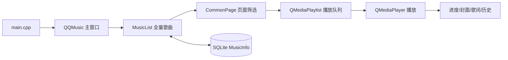

# QQMusic v1


一个基于 Qt Widgets 实现的本地音乐播放器 Demo，界面和交互参考 QQ 音乐。项目支持本地歌曲导入、播放控制、歌词同步、歌曲收藏、最近播放和 SQLite 数据持久化等常见音乐播放器功能。

> 本 README 对应项目扩展前的 v1 版本，基线提交为 `40c19e949dead87def4bfbded406040d5ef7e7a2`。

## 功能

- 导入本地 MP3、FLAC、WAV 文件，并读取歌曲名称、歌手、专辑和时长。
- 播放、暂停、上一首、下一首、随机播放、列表循环和单曲循环。
- 音量调节、静音、播放进度拖拽和播放状态显示。
- 歌曲封面显示与同名 LRC 歌词同步。
- “本地歌曲”“我喜欢”“最近播放”三个歌曲页面。
- SQLite 保存歌曲信息、收藏状态和播放历史。
- 无边框窗口、窗口拖动、最小化、系统托盘和单实例运行。
- 推荐页面图片轮播与卡片交互效果。

## 技术栈

- C++11
- Qt 5.14.2 Widgets
- Qt Multimedia：`QMediaPlayer`、`QMediaPlaylist`
- Qt SQL：SQLite 驱动
- Qt Designer `.ui` 文件
- Qt Resource System：`Resource.qrc`

## 项目结构

```text
QQMusic/
├─ QQMusic_v1/       # v1 独立源码快照
├─ QQMusic/          # 当前开发目录
├─ README.md         # 项目说明
└─ QQMusicPlayer.xmind
```

v1 的完整源码位于 [QQMusic_v1](QQMusic_v1/)，其中包含工程文件、C++ 源码、Qt Designer 界面文件、资源文件和示例音乐。当前开发目录 [QQMusic](QQMusic/) 与 v1 分开保存，便于继续进行后续开发。

## 核心架构



`MusicList` 维护内存中的歌曲集合，`Music` 表示一首歌曲及其收藏、历史状态；`CommonPage` 根据页面类型筛选歌曲 ID 并生成列表行；主窗口负责把页面操作转换为播放器操作，再通过 Qt 信号槽把播放状态反馈到界面。

## 构建与运行

推荐使用 Qt 5.14.2 和 MinGW 7.3。在 Windows PowerShell 中执行：

```powershell
cd QQMusic_v1
$env:PATH = "D:\QT5\Tools\mingw730_64\bin;D:\QT5\5.14.2\mingw73_64\bin;$env:PATH"
qmake QQMusic.pro CONFIG+=debug
mingw32-make -f Makefile -j2
```

构建 Release 版本：

```powershell
qmake QQMusic.pro CONFIG+=release
mingw32-make -f Makefile -j2
```

也可以直接使用 Qt Creator 打开 [QQMusic_v1/QQMusic.pro](QQMusic_v1/QQMusic.pro) 构建运行。运行时需要 Qt Multimedia、SQLite 和 Qt 平台插件，通常由 Qt Creator 或 Qt 部署工具提供。

## 运行数据

程序使用相对路径 `QQMusic.db` 保存 SQLite 数据库，数据库位置取决于程序启动时的工作目录。示例歌曲和对应歌词位于 [QQMusic_v1/musics](QQMusic_v1/musics/)。

## 相关文件

- [v1 源码](QQMusic_v1/)
- [QQMusic 工程文件](QQMusic_v1/QQMusic.pro)
- [项目思维导图](QQMusicPlayer.xmind)

## 许可证

本项目仅用于学习 Qt/C++ 项目开发与桌面应用架构。
